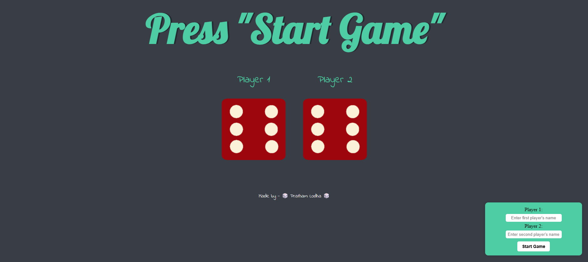

# 🎲 Dice Game

A simple and fun dice game where two players roll dice, and the one with the higher number wins! Built with HTML, CSS, and JavaScript, this project allows users to enter their names once, and then simply roll the dice with a button click.

## 🚀 Features

- 🎭 Enter player names only once (saved in session storage)
- 🎲 Random dice rolls on each refresh
- 🏆 Displays the winner dynamically
- 🎨 Clean and modern UI with a floating control panel
- 🔄 "Roll the Dice" button for quick replays

## 📸 Screenshots


## 🛠️ Technologies Used

- **HTML** for structure
- **CSS** for styling
- **JavaScript** for game logic

## 🔧 Setup & Usage
  
  **Clone the repository:**
   ```sh
   git clone https://github.com/your-username/dice-game.git
   ```

## 🎮 How to Play

1. Enter player names when prompted (only once).
2. Click **Start Game** to begin.
3. Press **"Roll the Dice again"** to play again.
4. The game announces the winner based on the highest roll.

## 💡 Session Storage Usage

I didn't know much about session storage initially, so I used GPT's help to implement it. This feature allows player names to persist across refreshes without requiring re-entry.

## 📌 Future Enhancements

- 🎨 Improve UI with animations
- 📊 Track score history
- 🎵 Add sound effects

## 🤝 Contributing

Want to contribute? Feel free to fork the repo and submit a pull request!


---

Built with ❤️ by **[Pratham Lodha](https://github.com/bhinfinity)**

